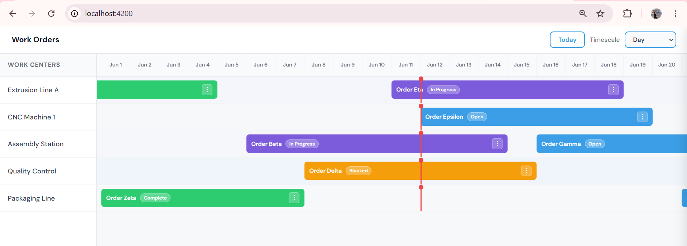
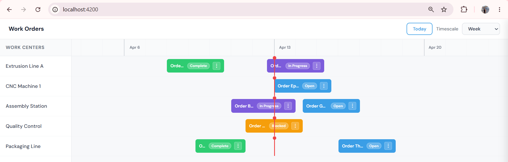
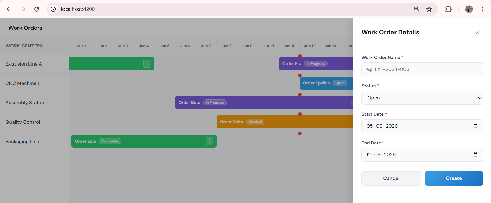
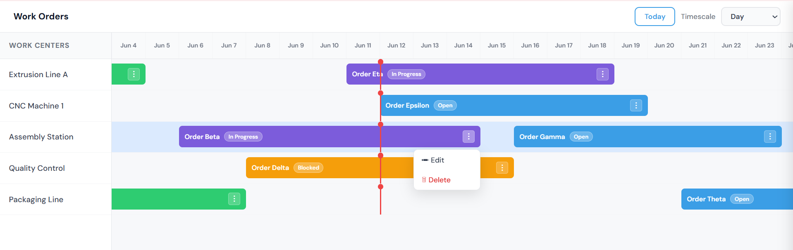
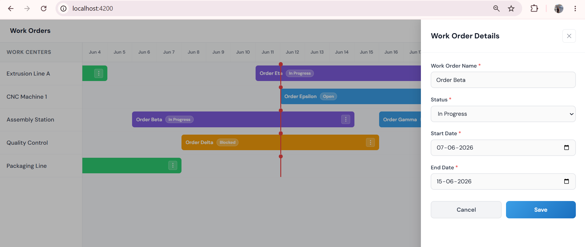
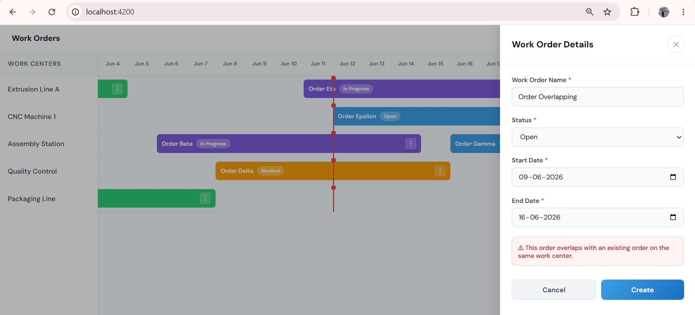

# Work Order Timeline

An interactive timeline component for managing manufacturing work orders across work centers.

## Getting Started

### Prerequisites
- Node.js v18+
- Angular CLI: `npm install -g @angular/cli`

### Installation
```bash
npm install
```

### Run
```bash
ng serve
```

Open `http://localhost:4200`

---

## Features

- **Timeline grid** with Day / Week / Month zoom levels
- **Work order bars** with color-coded status indicators
- **Create** new work orders by clicking any empty row
- **Edit** existing orders via the 3-dot menu
- **Delete** orders via the 3-dot menu
- **Overlap detection** — prevents scheduling conflicts
- **Today indicator** — red line showing current date
- **Today button** — jumps viewport to current date
- **Row hover** highlight for better UX

## Status Colors

| Status | Color |
|---|---|
| Open | Blue |
| In Progress | Purple |
| Complete | Green |
| Blocked | Orange |

## Libraries Used

- **Angular 21** — framework
- **Angular Reactive Forms** — form handling and validation

## Project Structure
```
src/app/
├── core/
│   ├── models/          # WorkCenter and WorkOrder interfaces
│   └── services/        # WorkOrderService (data + CRUD)
└── features/
    └── timeline/
        ├── timeline/        # Main timeline component
        └── create-edit-panel/  # Slide-out form panel
```

## Approach

1. Static timeline grid rendered by calculating visible date range
2. Work order bars positioned using pixel offsets from date math
3. Single panel component handles both create and edit via `mode` flag
4. Overlap detection checks date ranges before saving

## Screenshots

### Day View


### Week View


### Create Work Order


### Edit Dropdown


### Edit Work Order


### Overlap Validation
